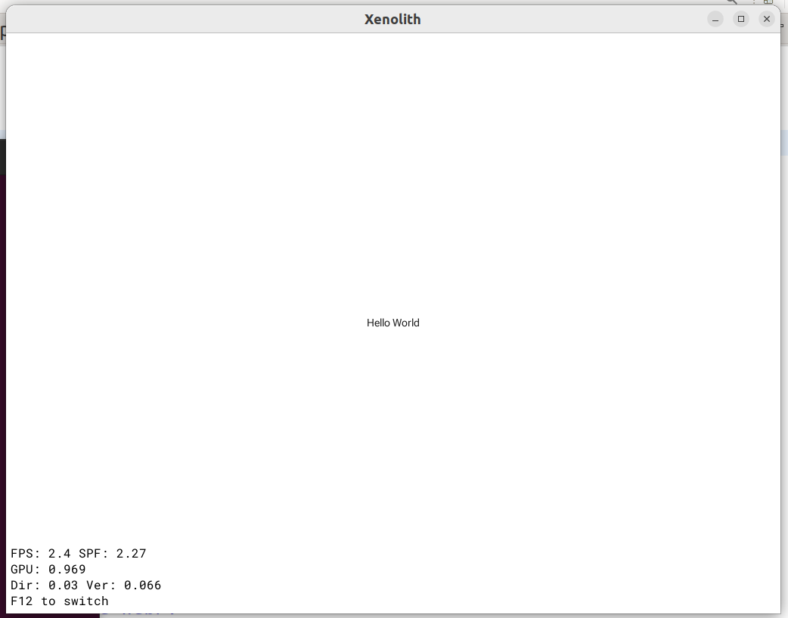

# Example GUI application on the Vulkan API

The application builds a basic graphics scene and draws it with the Vulkan API in an OS window.

## Requirements

Build tools: a C and a C++ compiler, make. Vulkan installed system-wide, or the
[Vulkan SDK](https://github.com/libstappler/libstappler-doc/blob/master/docs-ru/other/vulkan.md).

## Layout

Sources are grouped by the subsystem a test exercises, one directory per group. Everything under
`src/` is compiled (the source scan is recursive) and `src/` itself is the include root, so a header
is included by its group-qualified path: `#include "app/TestLayout.h"`.

    Makefile                  project description
    src/app/                  the application itself, not a test of anything
      AppSetup.cpp              entry point and command-line hooks
      ExampleScene.cpp,.h       the base scene; the `layout`, `layouts` and `dialog` commands
      TestRegistry.cpp,.h       the tree of demo layouts - the single place a test is declared
      TestLayout.cpp,.h         common base of every layout: caption, stylesheet, socket commands
      TestMenuLayout.cpp,.h     one level of the test menu: the subgroups of a group, then its tests
      GeneralLayout.cpp,.h      the front page: the top level of that menu, window and clipboard controls
      LiveReloadAppThread.*     `--watch`: rebuild and relaunch the client app
      ProjectBuildThread.*      the off-thread builder it drives
    src/css/                  CSS engine: selectors, cascade, live reload
    src/layout/               placement and measurement: flex/grid, fit-content, margins, resize
    src/widgets/              ui:: widgets and their styling; scroll virtualization
    src/text/                 text shaping
    src/template/             pug templates and the template-system cascade
    src/render/               what reaches the screen: damage tracking, rendering levels
    src/window/               windows: a second Root window, prewarmed queues, monitors/fullscreen
    resources/                bundled assets
    client/                   companion app for the shared-queue (remote rendering) demo
    text-input-check.py       headless assertions for the ui::TextInput demo (see below)
    form-check.py             headless assertions for the ui::FormSystem demo
    hotkey-check.py           headless assertions for the global hotkey controller
    menu-check.py             headless assertions for ui::MenuSource / ui::MenuSystem
    select-check.py           headless assertions for the ui::Select demo
    number-check.py           headless assertions for the ui::NumberField demo
    vector-check.py           headless assertions for the ui::VectorField demo
    color-check.py            headless assertions for the ui::ColorField demo
    chip-check.py             headless assertions for the ui::Chip / ui::ChipRow demo
    clipboard-check.py        headless assertions for xenolith::ClipboardSession
    picker-check.py           headless assertions for the ui::SearchPicker demo
    inline-edit-check.py      headless assertions for the ui::InlineEditor demo
                              (label, table cell, and a FACTORY-built editor)
    table-reorder-check.py    headless assertions for ui::TableView geometry and reorder
    drag-check.py             runs the four drag-and-drop stands, one process each, and
                              reports the summary each of them prints
    scrollbar-check.py        headless assertions for basic2d::ScrollView's scroll bar:
                              geometry, the drag, the paint, and the pointing device
    context-menu-check.py     headless assertions for ui::ContextMenuComponent /
                              ui::ContextMenuSystem: who is asked, and what refuses
    hit-test-check.py         headless assertions for the per-frame hit-test registry:
                              paint order, rotation, scissors, flags and padding
    tooltip-check.py          headless assertions for ui::TooltipComponent hover hints:
                              the coordinator, the dwell, and a node that slides away
    style-check.py            headless assertions for the CSS engine: control states, the
                              functional pseudo-classes, and the arithmetic
    scale9-check.py           headless assertions for basic2d::Scale9Sprite geometry
    geometry-check.py         headless assertions for window geometry and monitors
    text-undo-check.py        headless assertions for ui::TextHistory (the text-view stand)
    xcb-side-check.py         left/right modifiers on a REAL X11 window (not headless)

The registry mirrors that tree: one `TestInfo` array per directory, tied together by the `TestGroup`
list at the bottom of `src/app/TestRegistry.cpp`. So a test is addressed the way its sources are -
`css/nth` - and the menu, which is built by walking the registry, has the same levels: the front
page lists the groups, a group lists its tests, and a group may hold groups of its own.

A new test is a `*Layout.cpp,.h` pair in the group it belongs to, plus one entry in that group's
array - nothing else has to be told about it, neither the Makefile nor the menu. A new group is a
new directory plus one `TestGroup` entry pointing at its array.

The short id (`nth`) stays unique across the whole registry: it is what prefixes the commands a
layout registers (`nth.insert`), and the `layout` command takes either form.

## Headless checks

Most demos are verified by looking at them. `ui::TextInput` is not: what it does - the caret
following the platform's echo, a composition that must not count as a text change, Enter arriving
as text rather than as a key - is invisible in a screenshot. `text-input-check.py` drives it over
the inspector socket instead, starting its own headless instance:

```
python3 text-input-check.py [path-to-testapp]
```

It prints `N checks, M failures` and exits non-zero on a failure. Note how text gets in: a key
event only becomes text when it is injected with `native: true`, which routes it through the OS
window and therefore through the platform's text-input processor; IME composition has no keystroke
at all and goes through the separate `text` command.

`xcb-side-check.py` is the exception to all of this: it needs a live X11 server and python-xlib,
because it drives a real window with XTEST. That is the only way to check that the backend reports
which *side* of a modifier was pressed - the inspector injects a modifier bitmask directly and
never exercises xcb at all. Run it by hand after touching key handling in `XcbWindow`.

Three things a screenshot is especially bad at, and all three are asserted rather
than looked at. A **unit** beside a number (`number.set-unit`, `vector.set-unit`)
has to be a separate node, so the checks read the label off the node AND watch the
text viewport get narrower - a unit painted on top of the number would look
identical and break `parse(format(v)) == v`. A **locked** control
(`form.set-locked`) has to leave the tab ring, not merely grey out, so the check
reads `tabRing`; and because the lock and the widget's own `setEnabled` are two
independent sources of one effect, there is a check that unlocking gives back what
the application last asked for rather than "on". And an untouched widget's
`InteractiveComponent` is captured in section 1, while the form is provably
untouched, because a component created lazily on first focus looks identical by
the end of the script - which is exactly the bug that made `:disabled` match an
ENABLED checkbox.

`form-check.py`, `hotkey-check.py`, `menu-check.py`, `select-check.py`, `number-check.py`,
`vector-check.py`, `color-check.py`, `chip-check.py`, `picker-check.py`,
`inline-edit-check.py`, `table-reorder-check.py`, `geometry-check.py`,
`clipboard-check.py` and `text-undo-check.py` work the same way,
for the same reason: the order in which listeners are offered
a key, and who declined it, leaves no trace on the screen at all. A `ui::Select`'s
open list is a WINDOW, so the keys that walk it are addressed to that window and the check has to
say so; and while it is open the field beside the control must see nothing, which is the only way
to observe that the menu's exclusive focus group is doing its job. A `ui::NumberField` refusing a
number and accepting one that happens to look the same are identical on screen, so the value, the
validity and the callback count are all read back as numbers. A `ui::VectorField` is a row of
those, and everything worth checking about it is a relation rather than a picture: what the form
collects is ONE array under one name, Tab has to walk the components and leave only at the ends,
and a Shift+Tab entering the row has to land on its LAST component - which is what the `backwards`
argument of `FormFieldSlots::setFocused` exists for. A `ui::ColorField` has TWO pickers, and which
one a tap opens is the claim: headless advertises no colour dialog at all, so `auto` has to resolve
to the widget's own surface - a real popup window whose swatches the check clicks - while `system`,
asked for explicitly, has to fail with a reason rather than open nothing and go quiet. A
`ui::ChipRow` is the other kind of composite: the arrows walk its chips and Tab LEAVES it, its
limit and its uniqueness are claims about what the interface offers rather than about what it
refuses afterwards (at the maximum the "+" is dead, and an id already in the row comes up disabled
inside the menu's own window), and Backspace with nothing selected has to SELECT rather than
delete. Its height is the other invisible thing: a row that wraps onto four lines has to report the
height it actually draws at, which the check reads back beside the chips' own rectangles. A
`ui::SearchPicker` highlights the characters a matcher named, and the row led by two emoji is the
only place where a highlight counted in code points and one counted in UTF-16 units disagree - a
difference no screenshot distinguishes from a font. Three of its claims are invisible in a
different way, being about a state that DRAWS nothing: that an open popup hands its panel back
(`getContent()`, which the studio's palette was the first caller to need and got null from until
`SubWindow::getPanel()` existed), that a grouped list opened on a value reveals the one category
holding it, and that no selection selects no ROW - a grouped tree used to draw the first category
header highlighted for it, because "stands for no hit" and "is not a hit" were the same number. A `ui::InlineEditor` is the strongest case of
all: its whole reason to exist is that rebuilding every row of a virtualized table underneath an
open editor leaves the typed text alone, and that a scroll ENDS the edit by keeping what was typed
rather than dropping it. Nothing about either is visible in a frame - the editor looks the same
whether the text survived or was silently replaced by a rebuild. `ui::TableView`'s reorder is two such claims at once: a row scrolled out of view still has to
answer with a rectangle - which is what the drop index and the insertion line are computed from -
and after a move the selection has to follow the ROW rather than the index it used to sit at, two
states that look identical for one frame and diverge forever after. The hotkey
stand carries four subscribers on
one combination - one that declines, one global, one FocusedOnly inside a focus group and one inside an exclusive group - and every check reads back the delivery
log. Both scripts send `keychar` with every synthetic key: a keychar-less event skips the
text-input processor, which is exactly the false positive that once hid the Ctrl-chord bug.

`style-check.py` is the CSS engine's first headless check, and it exists for the seam rather than
for the parser. css/hover already checks that `:hover` and friends are understood - it assigns the
interactive bits by hand, which is the right way to test a parser and no way at all to test whether
a widget's own state ever reaches a selector. So here every state is put there by its real producer:
the form rejects an empty required field (`:invalid`, watched through two properties at once), an
edit lock takes a control away
(`:read-only` AND `:disabled`, two claims a lock makes at once), a text input is switched to
read-only, a progress bar is given no total, the submit button becomes the form's default, and the
tab ring is walked so that focus arrives by keyboard rather than by tap. The assertions read the
RESOLVED style rather than the painted colour, because the claim is that a rule matched; a widget
that does not paint its own background would otherwise fail a check about the cascade.

It runs THREE stands in one process, switching with the inspector's `layout` command: `css/state`,
then `css/selector`, then `css/calc`. The order is fixed rather than incidental - a stand's commands
go away with it - and the arrangement is what lets one script cover the engine instead of three
scripts each paying for an app launch.

The selector half is mostly pairs of rules written to CONFLICT, because matching is only half of
what `:is()` and `:where()` do. `:where()` matches exactly like `:is()` while counting for nothing,
so the only way to tell them apart is to put a rule using one against a rule that would otherwise
lose to it, and read which colour won - a number, not a picture. The refusals are asserted too: an
argument with a combinator, a nested functional pseudo-class, a structural one, an empty list or an
unbalanced paren must take down its OWN rule and leave the rules around it standing.

The arithmetic half used to check itself and write the tally to the log, where nothing ran it. Its
expectations now live in the script (duplicated on purpose, like everywhere else here) and the stand
only reports what resolved - plus what the layout actually APPLIED, which is the half that proves a
changed custom property invalidated anything at all: nothing moves and no rule starts matching when
`--k` changes, so the applied width is the only witness.

Two states there are worth naming. `:focus-visible` is asserted on the CHECKBOX, because a text
input is always focus-visible by design - it shows a caret the moment it has focus, however focus
got there - and so is the one widget that cannot tell keyboard focus from a tap. And `:focus-within`
is the only state a node does not carry in its own InteractiveComponent: giving a panel interactive
state just to hold it would switch `:enabled` on and `:disabled` off for that panel while focus
happened to be inside, so it is published by a marker component instead (XLUiFocusWithin.h).

`scale9-check.py` is the one case here where the thing on screen IS the subject and a screenshot
is still the wrong instrument. A nine-slice sprite claims that its corners did not stretch and that
its nine texture rects tile the picture exactly - claims that are numbers, and numbers a PNG
comparison would test the rasterizer for rather than the slicing. The stand exposes a Scale9Sprite
subclass that reports the quads the sprite actually wrote, and the script asserts on those: corner
sizes that stay put across three content sizes, a sub-rect of the same texture that must come out
with the SAME view geometry and different texture coordinates (the slice is measured in pixels of
the fragment), a zero side that emits no quad at all, a box smaller than its own corners that
shrinks them in proportion instead of refusing, and a slice leaving no middle that IS refused - with
the numbers, and drawn as a plain sprite rather than not drawn.

`clipboard-check.py` is there for a seam rather than a widget, and for one property in particular:
the clipboard transport is answered EXACTLY ONCE. That is not what the platforms do — wayland drops
a request whose selected type it did not offer, without calling anything back, while the base
controller both calls back and returns a failure — so the count of deliveries is asserted as a
number after every read, including a read whose preference list matches nothing. The same script
covers the halves that used to be duplicated between `ui::TextInput` and `ui::TextView`: what one
copies the other must paste, a masked field must still refuse, and a paste whose field lost focus
must not land.

`scrollbar-check.py` runs the stand twice: once as usual and once under
`--headless-no-pointer`. That second pass is the reason `WindowState::InputPointer`
exists — the bar is thick, grabbable and permanent where a pointing device is attached,
and thin, inert and fading where none is — and it is not observable any other way: the
two look alike in a screenshot and identical in the scene tree. The paint section works
the same way in miniature, checking the bar BEFORE `ui::useStyledScrollIndicator` as
well as after: `background-color` must reach it either way, `border-radius` and
`outline` only after, and a check that only looked at the second half would pass just as
happily if the swap had happened somewhere it should not.

It also looks at the PIXELS, which no other check here does, and that is not thoroughness for its
own sake: the bar was invisible on screen for a while with every number about it right. The thumb
is a child of the track, opacity multiplies down a subtree, and the track sits at zero opacity
whenever the pointer is not on it — so the bar was drawn only while being pointed at, and the
state a check reads (size, position, opacity, resolved fill) said nothing about it. The screenshot
is decoded in-process with `zlib`; no image library is needed.

One more trap it encodes, because it cost an hour: a press aimed at the exact boundary
between two rows reaches NEITHER row, so `rowTaps` reads 0 and looks like "the bar
swallowed it". The stand reports a second counter, `viewTaps`, for that reason - the
scroll view's own answer to the same press tells "delivered and swallowed" from "never
arrived".

`context-menu-check.py` is mostly about menus that must NOT open, which on screen is
indistinguishable from nothing happening: an invisible target, a target that offers nothing, a
widget that swallows the right button, a right DRAG rather than a click, and a mouse held down for
as long as a finger would be. The stand answers with two counters rather than one - how many
builders ran and which target answered - because "refused" and "never reached" are different bugs
that look alike from outside. The menu itself is a real window in headless, so what it contains is
read out of its own scene and a row is clicked in it by id.

`hit-test-check.py` asks the registry directly, with no subsystem in the way, because every rule it
has is invisible from outside: a node that answers when it should not looks exactly like one that
answers correctly until you ask WHAT answered. The two checks worth knowing about are the square
turned 45 degrees - a point in the corner of its own bounding box is a MISS, which the per-target
rosters this registry replaced got wrong - and the node overflowing a scissor, which is a fact about
the frame it was drawn in and cannot be derived from the node alone.

`tooltip-check.py` declares every hint in `init()`, before the layout is in a scene, and never
acquires a `TooltipSystem`. That is deliberate: a hint is data now, and data cannot notice its own
arrival in a scene the way the listener it replaced could, so the coordinator existing at all is the
first assertion - and the one that would silently break every hint an application declares while
building a widget. The last section slides a node out from under a pointer that does not move, which
is the case no synthetic pointer movement would ever catch.

`drag-check.py` is the odd one out: it asserts nothing itself. The four drag stands
(`drag/drag-basic`, `drag/drag-actions`, `drag/drag-payload`, `drag/drag-text`) run their phases
from a `Sequence` of `DelayTime`s and do their own checking, ending with a
`SUMMARY: N checks, M failures` line, so what a driver owes them is time - and in headless there is
no time except the frames it asks for. The script steps frames until that line appears rather than
waiting a fixed count, which would bake this machine's pacing into the test.

It gives each stand its own PROCESS, and that is the point of it rather than an accident: the
`DragSystem` lives on the scene content, not on a layout, so stands sharing a process share it too.
A stand that begins a drag in one phase and commits it in another has to cancel it in `handleExit`,
or a layout switch landing mid-sequence leaves the session in flight and the next stand finds
`beginDrag` refusing with the cursor stuck on `Grabbing`. Nothing ends a programmatic drag on its
own - it has no input chain, so the release detection that watches a press chain never applies.
`drag-basic` and `drag-actions` do cancel, so the layout sweep passes either way; a process per
stand is what makes a failure mean what it says.

## Building

With the Vulkan SDK:

```
make VULKAN_SDK_PREFIX=<platform prefix inside the SDK>
```

With system-wide Vulkan:

```
make
make install
```

A successful build looks like this:

```
Build for x86_64
Build executable: stappler-build/host/debug/gcc/testapp
Enabled modules: xenolith_backend_vkgui xenolith_renderer_ui stappler_build_debug_module xenolith_backend_vk xenolith_renderer_basic2d xenolith_renderer_basic2d_shaders xenolith_scene xenolith_font xenolith_application xenolith_platform xenolith_resources_icons xenolith_core  stappler_font stappler_bitmap stappler_brotli_lib stappler_vg stappler_tess stappler_geom stappler_data stappler_filesystem stappler_core
Modules was updated
[glslangValidator] xl_2d_material.frag/main.frag
...
[testapp: 100% 29/29] [g++] main.o
[Link] stappler-build/host/debug/gcc/testapp
```

The resulting application lands in `stappler-build/host/debug/gcc/testapp`

## Running

By default the application opens an OS window, so it has to run on a system with graphical output.

```
$ stappler-build/host/debug/gcc/testapp --help
testapp <options>:
Options:
  -v, --verbose / -q, --quiet / -h, --help
  -W<#>, --width <#>      - Window width
  -H<#>, --height <#>     - Window height
  -D<#.#>, --density <#.#>  - Pixel density for a window
  --l <locale>, --locale <locale>
  --bundle <bundle-name>
  --gapi <api>            - Select graphics API backend (vulkan, webgpu, metal)
  --renderdoc / --novalidation / --device <#>
  --headless              - Run without a window system: render into offscreen
                            images and accept control over the inspector socket
  --decor <decoration-description>
$ stappler-build/host/debug/gcc/testapp
```



## Headless runs and screenshots

With `--headless` the application starts with no window system at all: Vulkan draws into a
pseudo-swapchain of ordinary device images. That works over SSH, in CI, on a server, with the
monitor asleep.

In this mode the scene inspector socket takes the place of the window: it is how the scene graph is
inspected, the log is read, layouts are switched, commands are sent to them and the "screen" is
captured.

### Starting it

```sh
cd tests/window
XENOLITH_INSPECTOR_ADDRESS=unix:/tmp/xl-$$.sock \
	./stappler-build/x86_64-unknown-linux-gnu/debug/cc/testapp \
		--headless --width 1024 --height 768 &
```

Things worth knowing:

* **Use a per-run socket path.** The default one (`/tmp/xenolith-inspector.sock`) is unconditionally
  unlinked before bind, so two running applications silently take it from each other. The client
  gets the same `XENOLITH_INSPECTOR_ADDRESS`.
* **The working directory is `tests/window`.** Resources (`resources/xenolith-2-480.png`, fonts) are
  resolved against it; `Fail to add image: ..., file not found` in the log means the wrong cwd, not
  a broken headless mode.
* **`--width/--height` are the surface in pixels.** `--density` only changes the logical scale and
  does not multiply the surface: to reproduce a 1024×768 window on a HiDPI screen, pass
  `--width 2048 --height 1536 --density 2`.
* **Stop it with the `quit` command**, not with a signal: it closes the window, tears the context
  down and exits with status 0.

### The application's commands

| Command | Arguments | What it does |
|---|---|---|
| `layouts` | — | the layouts twice over: `layouts`, the flat list (`name`, `path`, `group`, `title`, `description`, `env`, `hideFps`), and `tree`, the same entries grouped the way the registry is |
| `layout` | `name` (the id `nth` or the path `css/nth`), `settle` (seconds, 1.0 by default) | switch the layout; the answer arrives once the new one has been rendering for `settle` seconds |
| `dialog` | `type` (`open-file`, `open-directory`, `save-file`, `color`, `font`, `reveal`, `trash`), `path`, `filename`, `paths`, `title`, `modal`, `multiple` | open a system dialog on the main window; answers with the `DialogResult` once the user is done. `reveal` and `trash` show no UI of ours, so they are the two that can be exercised without a display |

The answer to `layout` *is* the "you may shoot now" signal: the command deliberately does not reply
before the scene has laid out and finished its entry animations. That is why the script below needs
neither a `sleep` nor a tuned delay.

The layout on screen adds its own commands under a `<name>.` prefix - the same actions its control
bar offers (`TestLayout::registerCommands`). For example:

| Command | What it does |
|---|---|
| `flex.mode` | flexbox ↔ grid; likewise `flex.dir`, `flex.wrap`, `flex.justify`, `flex.align` |
| `pug.theme` | swap the whole stylesheet (light ↔ dark); likewise `pug.accent`, `pug.rebuild` |
| `fit-content.append` | extend a label: `{ "count": 2 }`; likewise `fit-content.wrap` |

A layout's commands live exactly as long as it is on screen; the protocol command `commands` lists
whatever is registered at the moment. Each of them takes its own `settle` too (0.5 s by default).

### Talking to the socket

The easiest way is the `scene-inspector` MCP server together with the `gui-debug` skill: they
provide `inspect_scene`, `get_logs`, `list_commands`, `invoke_command`, `screenshot` and `quit_app`
ready to use.

A client of your own is a one-line handshake followed by `[u32 LE size][JSON]` frames:

```python
import json, socket, struct, base64

s = socket.socket(socket.AF_UNIX, socket.SOCK_STREAM)
s.connect("/tmp/xl-1234.sock")
s.sendall(b"xenolith/1 json\n")          # answer: "# xenolith/1 ok json\n"
buf = s.recv(4096).split(b"\n", 1)[1]

def call(cmd, serial=[0], **args):
    serial[0] += 1
    req = dict(args, serial=serial[0], cmd=cmd)
    payload = json.dumps(req).encode()
    s.sendall(struct.pack("<I", len(payload)) + payload)
    global buf
    while True:                           # answers may arrive out of order
        while len(buf) < 4 or len(buf) < 4 + struct.unpack("<I", buf[:4])[0]:
            buf += s.recv(65536)
        size = struct.unpack("<I", buf[:4])[0]
        resp, buf = json.loads(buf[4:4 + size]), buf[4 + size:]
        if resp.get("serial") == serial[0]:
            return resp

# scene commands are reached through the `invoke` protocol command
call("invoke", name="layout", args={"name": "flex"})
call("invoke", name="flex.mode")
png = call("screenshot")["result"]["data"]        # "BASE64:<base64url, unpadded>"
open("flex-grid.png", "wb").write(
        base64.urlsafe_b64decode(png[7:] + "=" * (-len(png[7:]) % 4)))
call("quit")
```

### The whole sweep: one screenshot per layout

```python
for it in call("invoke", name="layouts")["result"]["layouts"]:
    call("invoke", name="layout", args={"name": it["name"]})   # returns once it has settled
    data = call("screenshot")["result"]["data"]
    ...                                                        # save as it["name"] + ".png"
call("quit")
```

This fully replaces the earlier environment-driven batch mode (`XL_SCREENSHOT_TESTS`/`DIR`/`DELAY`,
`XL_FLEX_GRID`, `XL_PUG_DARK`, `XL_FITCONTENT_APPEND`): that one shot a list fixed up front in a
single run and then exited, whereas the same thing is now driven from outside, in any order.

## Android

To run on Android, import the gradle project from the proj.android directory into Android Studio.

How applications work on Android is explained
[here](https://github.com/libstappler/libstappler-doc/blob/master/docs-ru/other/android.md#%D1%81%D0%BE%D0%B7%D0%B4%D0%B0%D0%BD%D0%B8%D0%B5-%D0%BF%D1%80%D0%B8%D0%BB%D0%BE%D0%B6%D0%B5%D0%BD%D0%B8%D1%8F-%D0%BD%D0%B0-android).

## Mac

The XCode project lives in the proj.macos directory.

To create a new one:

* Create an application project in XCode
* Delete the automatically generated code
* Turn off user script sandboxing (Build Settings -> User Script Sandboxing -> No)
* Add a user script to Build Phases, as early in the list as possible. Its body:
  `make -C .. mac-export RELEASE=1` - replace `..` with the path from the XCode project file to the
  project's Makefile.
* Run the build (it will fail)
* Add the generated macos.projectconfig.xcconfig to the project and assign it as the configuration
  of the build target (not of the project!) for both Debug and Release
* Add libstappler-root/core/proj.macos/core.xcodeproj and
  libstappler-root/xenolith/proj.macos/xenolith.xcodeproj as subprojects
* Add the libstappler-core and libstappler-xenolith targets as Target Dependencies
* Link the module libraries the application needs (Link Binary With Libraries)
* Add the project sources to XCode for building (Compile Sources)

To add Vulkan:

* Add the libstappler-root/xenolith/proj.macos/vulkan directory to be copied
  (Copy Bundle Resources -> Add others)
* Add the SDK libraries to the XCode project: libMoltenVK.dylib,
  libVkLayer_khronos_validation.dylib, libvulkan.1.dylib, libvulkan.<SDKVER>.dylib (do not add them
  to the target in the dialog!)
* Add libMoltenVK.dylib, libvulkan.1.dylib, libvulkan.<SDKVER>.dylib to General -> Frameworks,
  Libraries and Embedded Content (press + -> Add others)
* Add libVkLayer_khronos_validation.dylib under Build Phases -> Embed Libraries

To keep the project portable in git:

* Open the project file in a text editor (*.xcodeproj -> Show Package Contents -> project.pbxproj)
* Replace absolute paths starting with /Users with relative ones
